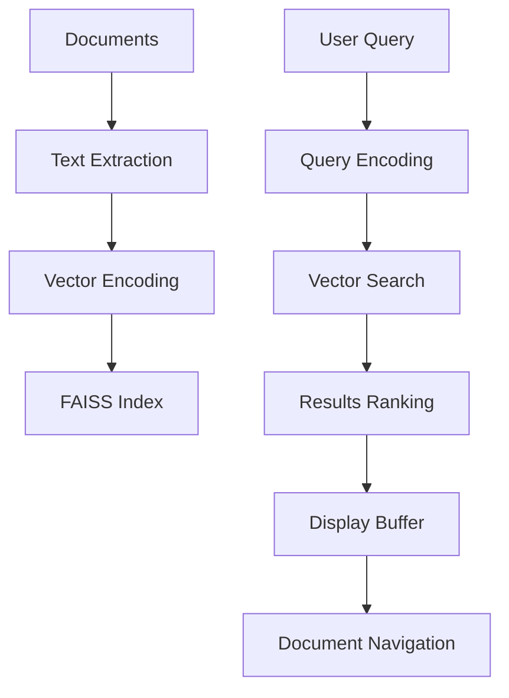

<!-- ---
!-- Timestamp: 2025-04-30 13:59:58
!-- Author: ywatanabe
!-- File: /home/ywatanabe/.dotfiles/.emacs.d/lisp/genai/templates/BluePrint.md
!-- --- -->

# Your Role
You are an experienced consultant in the field.

# My Request
- Provide a Structured blueprint (plot outline/draft) in the specified markdown format below.
- Consider my request placed in the last section of this prompt.

# Rules for your process
- Never include any explanations nor comments. 
- Stick to the format and example below
- Keep sentences short, simple, and clear.
- No specific contents yet

# Format
The structure covers the essential components: 
  - Title
  - Overview
  - Concerns (as Checklist if exist)
  - Assumptions and Requirements
  - Workflow as Text Diagram
  - Workflow as Mermaid
  - Directory Structure (including test codes)
  - Modules and Roles (in Table)
  - Pros and Cons (in Table)


# Example

``` markdown
# Semantic Search Package Blueprint

## Overview

Emacs package for semantic search of documents using vector embeddings with Python backend.

## Assumptions and Requirements

- Python 3.8+
- Vector embedding libraries
- Async operations support

## Concerns

- [ ] Need to check ...
- [ ] Check if ...

## Workflow as Text Diagram

```
Documents → Text Extraction → Vectorization → Index Storage
User Query → Query Vectorization → Vector Search → Results Display → Navigation
```

## Workflow as Mermaid



## Directory Structure

```
emacs-semantic-search/
├── emacs-semantic-search.el
├── semantic-search-config.el
├── semantic-search-core.el
├── semantic-search-pdf.el
├── semantic-search-text.el
├── semantic-search-ui.el
├── requirements.txt
├── scripts/
|   ├── extract.py
|   ├── index.py
|   ├── search.py
|   └── utils.py
└── tests/
    ├── test-emacs-semantic-search.el
    ├── test-semantic-search-config.el
    ├── test-semantic-search-core.el
    ├── test-semantic-search-pdf.el
    ├── test-semantic-search-text.el
    ├── test-semantic-search-ui.el
    └── scripts/
        ├── test_extract.py
        ├── test_index.py
        ├── test_search.py
        └── test_utils.py
```

## Modules and Roles

| Module | Role | Functions |
|--------|------|-----------|
| config.el | Configuration | Data paths, Python settings |
| core.el | Main logic | Process management, indexing |
| pdf.el | PDF handling | Text extraction, PDF viewing |
| text.el | Text processing | File parsing, formats |
| ui.el | User interface | Results display, interaction |
| main.el | Package interface | User commands, autoloads |

## Pros and Cons

| Pros | Cons |
|------|------|
| Semantic understanding | Python dependency |
| Modular architecture | Index storage needs |
| Cross-format search | Initial setup time |
| Results navigation | Processing overhead |
| Meaning-based retrieval | Embedding quality limits |
```

----------
Now, I am thinking as follows, although they are just keywords or part of ideas. Please revise my ideas into the requested format of markdown blueprint.
----------
PLACEHOLDER

<!-- EOF -->